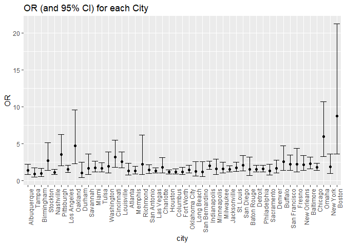
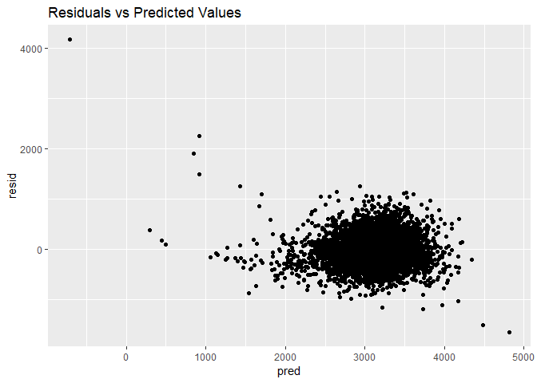
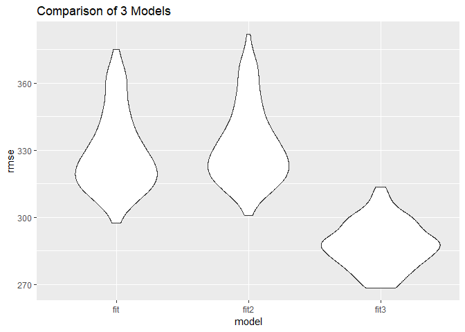

p8105\_hw6\_mp3653
================
Matthew Perrotta
November 27, 2018

### Load Packages

``` r
library(tidyverse)
```

    ## -- Attaching packages ---------------------------------------------------------------------------------- tidyverse 1.2.1 --

    ## v ggplot2 3.0.0     v purrr   0.2.5
    ## v tibble  1.4.2     v dplyr   0.7.6
    ## v tidyr   0.8.1     v stringr 1.3.1
    ## v readr   1.1.1     v forcats 0.3.0

    ## -- Conflicts ------------------------------------------------------------------------------------- tidyverse_conflicts() --
    ## x dplyr::filter() masks stats::filter()
    ## x dplyr::lag()    masks stats::lag()

``` r
library(modelr)
```

Problem 1
=========

### Import and Clean Data

``` r
homicide_data = read_csv('https://raw.githubusercontent.com/washingtonpost/data-homicides/master/homicide-data.csv') %>%
  janitor::clean_names() %>% 
  unite(city_state, c(city, state), sep = ", ", remove = FALSE) %>% 
  filter(!(city_state %in% c('Dallas, TX', 'Phoenix, AZ', 'Kansas City, MO', 'Tulsa, AL'))) %>% 
  mutate(outcome = as.factor(ifelse(disposition == 'Closed by arrest', 1, 0)),
         victim_age = as.numeric(victim_age),
         victim_race = ifelse(victim_race == 'White', 'white', 'non-white'),
         victim_race = fct_relevel(victim_race, 'white', 'non-white'),
         victim_sex = as.factor(victim_sex))
```

    ## Parsed with column specification:
    ## cols(
    ##   uid = col_character(),
    ##   reported_date = col_integer(),
    ##   victim_last = col_character(),
    ##   victim_first = col_character(),
    ##   victim_race = col_character(),
    ##   victim_age = col_character(),
    ##   victim_sex = col_character(),
    ##   city = col_character(),
    ##   state = col_character(),
    ##   lat = col_double(),
    ##   lon = col_double(),
    ##   disposition = col_character()
    ## )

    ## Warning in evalq(as.numeric(victim_age), <environment>): NAs introduced by
    ## coercion

### Regression

Logistic Regression and OR (and 95% CI) for Baltimore, MD

``` r
baltimore = homicide_data %>% 
  filter(city == 'Baltimore')

baltimore_lr = glm(outcome ~ victim_age + victim_sex + victim_race, data = baltimore, family = binomial())

#OR and 95% CI
baltimore_lr %>% broom::tidy() %>% 
  janitor::clean_names() %>% 
  mutate(OR = exp(estimate),
         lower_bound = exp(estimate - (1.96 * std_error)),
         upper_bound = exp(estimate + (1.96 * std_error))) %>% 
  filter(term == 'victim_racenon-white') %>% 
  select(OR, lower_bound, upper_bound) %>% 
  knitr::kable()
```

|        OR|  lower\_bound|  upper\_bound|
|---------:|-------------:|-------------:|
|  0.440608|     0.3129079|     0.6204234|

Logistic Regression and OR (and 95% CI) for all cities

``` r
city_lr = homicide_data %>% 
  group_by(city_state) %>% 
  nest() %>% 
  mutate(models = map(data, ~ glm(outcome ~ victim_age + victim_sex + victim_race, data = .x, family = binomial())),
         models = map(models, broom::tidy)) %>% 
  select(-data) %>% 
  unnest() %>% 
  janitor::clean_names() %>% 
  mutate(OR = exp(estimate),
         lower_bound = exp(estimate - (1.96 * std_error)),
         upper_bound = exp(estimate + (1.96 * std_error)))

#OR and 95% CI
city_lr %>% 
  filter(term == 'victim_racenon-white') %>% 
  select(city_state, OR, lower_bound, upper_bound) %>% 
  knitr::kable()
```

| city\_state        |         OR|  lower\_bound|  upper\_bound|
|:-------------------|----------:|-------------:|-------------:|
| Albuquerque, NM    |  0.7414698|     0.4512868|     1.2182443|
| Atlanta, GA        |  0.7528020|     0.4315063|     1.3133316|
| Baltimore, MD      |  0.4406080|     0.3129079|     0.6204234|
| Baton Rouge, LA    |  0.6676289|     0.3127439|     1.4252185|
| Birmingham, AL     |  1.0392783|     0.6150483|     1.7561211|
| Boston, MA         |  0.1145531|     0.0471531|     0.2782939|
| Buffalo, NY        |  0.3898879|     0.2127526|     0.7145036|
| Charlotte, NC      |  0.5575017|     0.3207914|     0.9688794|
| Chicago, IL        |  0.5620844|     0.4311321|     0.7328123|
| Cincinnati, OH     |  0.3183560|     0.1839996|     0.5508195|
| Columbus, OH       |  0.8547029|     0.6339868|     1.1522590|
| Denver, CO         |  0.6018870|     0.3589787|     1.0091626|
| Detroit, MI        |  0.6512456|     0.4877782|     0.8694953|
| Durham, NC         |  1.0028175|     0.4041085|     2.4885469|
| Fort Worth, TX     |  0.8378356|     0.5545077|     1.2659311|
| Fresno, CA         |  0.4478015|     0.2306060|     0.8695617|
| Houston, TX        |  0.8726047|     0.6986847|     1.0898176|
| Indianapolis, IN   |  0.5045560|     0.3817941|     0.6667909|
| Jacksonville, FL   |  0.6581751|     0.5023197|     0.8623880|
| Las Vegas, NV      |  0.7554159|     0.5864306|     0.9730958|
| Long Beach, CA     |  0.7939031|     0.3876546|     1.6258857|
| Los Angeles, CA    |  0.6658424|     0.4828459|     0.9181936|
| Louisville, KY     |  0.3919136|     0.2589809|     0.5930794|
| Memphis, TN        |  0.7823191|     0.5238191|     1.1683866|
| Miami, FL          |  0.5762370|     0.3772438|     0.8801975|
| Milwaukee, wI      |  0.6323892|     0.4033912|     0.9913854|
| Minneapolis, MN    |  0.6457029|     0.3447349|     1.2094287|
| Nashville, TN      |  0.8985913|     0.6533730|     1.2358427|
| New Orleans, LA    |  0.4659337|     0.2947205|     0.7366105|
| New York, NY       |  0.5314592|     0.2793572|     1.0110671|
| Oakland, CA        |  0.2129779|     0.1043603|     0.4346441|
| Oklahoma City, OK  |  0.6812533|     0.4780242|     0.9708841|
| Omaha, NE          |  0.1689228|     0.0935132|     0.3051432|
| Philadelphia, PA   |  0.6438263|     0.4862491|     0.8524692|
| Pittsburgh, PA     |  0.2815606|     0.1607457|     0.4931788|
| Richmond, VA       |  0.4474146|     0.1616764|     1.2381512|
| San Antonio, TX    |  0.6893496|     0.4613199|     1.0300939|
| Sacramento, CA     |  0.7807364|     0.4486304|     1.3586894|
| Savannah, GA       |  0.5964045|     0.2800315|     1.2702083|
| San Bernardino, CA |  0.8801457|     0.3928312|     1.9719832|
| San Diego, CA      |  0.4833560|     0.2976277|     0.7849839|
| San Francisco, CA  |  0.4582812|     0.2904504|     0.7230896|
| St. Louis, MO      |  0.5770478|     0.4059333|     0.8202928|
| Stockton, CA       |  0.3757201|     0.1964244|     0.7186762|
| Tampa, FL          |  1.1588262|     0.5870394|     2.2875435|
| Tulsa, OK          |  0.6024687|     0.4130931|     0.8786605|
| Washington, DC     |  0.5100815|     0.2577041|     1.0096200|

Plot of estimated ORs and CIs for all cities

``` r
city_lr %>% 
  filter(term == 'victim_racenon-white') %>%
  mutate(city_state = fct_reorder(city_state, OR)) %>% 
  ggplot(aes(x = city_state, y = OR)) +
  geom_point() +
  geom_errorbar(aes(ymin = lower_bound, ymax = upper_bound)) +
  theme(axis.text.x = element_text(angle = 90, hjust = 1)) +
  labs(
    title = 'OR (and 95% CI) for each City'
  )
```



All significant OR estimates indicate that the odds of a homicide being solved when the victim is non-white is lower than the odds of a homicide being solved when the victim is white. There are no significant OR values greater than 1. The city with the smallest OR and therefore the greatest disparity in solved cases is Boston, MA.

Problem 2
=========

### Import and Clean Data

``` r
birthwt = read.csv('./data/birthweight.csv') %>% 
  janitor::clean_names() %>% 
  mutate(babysex = as.factor(babysex),
         frace = as.factor(frace),
         malform = as.factor(malform),
         mrace = as.factor(mrace))

#Check to see if there is missing data
filter_all(birthwt, any_vars(is.na(.)))
```

    ##  [1] babysex  bhead    blength  bwt      delwt    fincome  frace   
    ##  [8] gaweeks  malform  menarche mheight  momage   mrace    parity  
    ## [15] pnumlbw  pnumsga  ppbmi    ppwt     smoken   wtgain  
    ## <0 rows> (or 0-length row.names)

### Model building

I hypothesis that the model for birthweight should include the variables for baby length(blength), family income (fincome), gestational age in weeks (gaweeks), and mother's pre-pregnancy BMI (ppbmi).

These variables were chosen for the following reasons:

-   blength - smaller babies will generally weigh less than larger babies
-   fincome - a proxy for SES
-   gaweeks - infants born early will be less developed and therefore should weight less
-   ppbmi - evidence shows that maternal prepregnancy BMI is related to infant birthweight (Heude B, Thiébaugeorges O, Goua V, et al. Pre-pregnancy body mass index and weight gain during pregnancy: relations with gestational diabetes and hypertension, and birth outcomes. Matern Child Health J. 2012;16(2):355-63.)

Hypothesized model and plot of residuals vs. predicted values

``` r
fit = lm(bwt ~ blength + fincome + gaweeks + ppbmi, data = birthwt)

birthwt %>% 
  modelr::add_predictions(fit) %>% 
  modelr::add_residuals(fit) %>% 
  ggplot(aes(x = pred, y = resid)) +
  geom_point() +
  labs(
    title = 'Residuals vs Predicted Values'
  )
```



Creation of 2 additional models

``` r
fit2 = lm(bwt ~ blength + gaweeks, data = birthwt)
fit3 = lm(bwt ~ bhead + blength + babysex + bhead*blength + bhead*babysex + blength*babysex + bhead*blength*babysex, data = birthwt)
```

Comparison of models

``` r
set.seed(1)

cv_df = crossv_mc(birthwt, 100) %>% 
  mutate(train = map(train, as_tibble),
         test = map(test, as_tibble))

cv_df = cv_df %>% 
  mutate(fit = map(train, ~fit),
         fit2 = map(train, ~fit2),
         fit3 = map(train, ~fit3)) %>% 
  mutate(rmse_fit    = map2_dbl(fit, test, ~rmse(model = .x, data = .y)),
         rmse_fit2 = map2_dbl(fit2, test, ~rmse(model = .x, data = .y)),
         rmse_fit3 = map2_dbl(fit3, test, ~rmse(model = .x, data = .y)))

cv_df %>% 
  select(starts_with("rmse")) %>% 
  gather(key = model, value = rmse) %>% 
  mutate(model = str_replace(model, "rmse_", ""),
         model = fct_inorder(model)) %>% 
  ggplot(aes(x = model, y = rmse)) + 
  geom_violin() +
  labs(
    title = 'Comparison of 3 Models'
  )
```



The best model is fit3, which is the linear regression of birthweight from the variables bhead, blength, and babysex, as well as all interaction terms. The above plot shows fit3 is the best model because it has the lowest range of rmse values, which indicates that the model explains more of the variance than the other two models.
