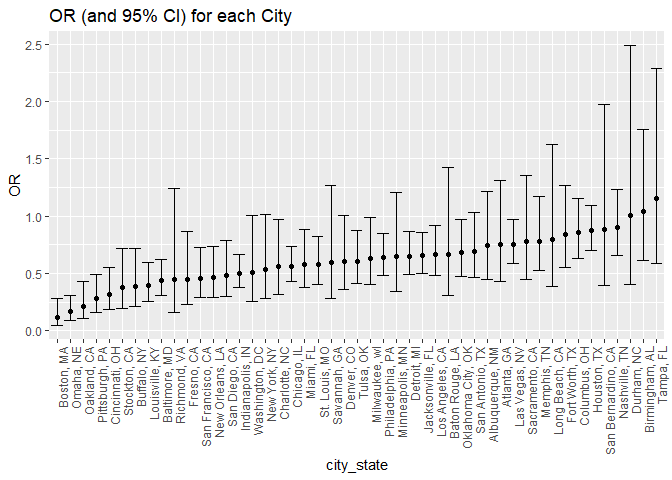

p8105\_hw6\_mp3653
================
Matthew Perrotta
November 27, 2018

### Load Packages

``` r
library(tidyverse)
```

    ## -- Attaching packages ---------------------------------------------------------------------------------- tidyverse 1.2.1 --

    ## v ggplot2 3.0.0     v purrr   0.2.5
    ## v tibble  1.4.2     v dplyr   0.7.6
    ## v tidyr   0.8.1     v stringr 1.3.1
    ## v readr   1.1.1     v forcats 0.3.0

    ## -- Conflicts ------------------------------------------------------------------------------------- tidyverse_conflicts() --
    ## x dplyr::filter() masks stats::filter()
    ## x dplyr::lag()    masks stats::lag()

Problem 1
=========

### Import and Clean Data

``` r
homicide_data = read_csv('https://raw.githubusercontent.com/washingtonpost/data-homicides/master/homicide-data.csv') %>%
  janitor::clean_names() %>% 
  unite(city_state, c(city, state), sep = ", ", remove = FALSE) %>% 
  filter(!(city_state %in% c('Dallas, TX', 'Phoenix, AZ', 'Kansas City, MO', 'Tulsa, AL'))) %>% 
  mutate(outcome = as.factor(ifelse(disposition == 'Closed by arrest', 'solved', 'unsolved')),
         victim_age = as.numeric(victim_age),
         victim_race = ifelse(victim_race == 'White', 'white', 'non-white'),
         victim_race = fct_relevel(victim_race, 'white'),
         victim_sex = as.factor(victim_sex))
```

    ## Parsed with column specification:
    ## cols(
    ##   uid = col_character(),
    ##   reported_date = col_integer(),
    ##   victim_last = col_character(),
    ##   victim_first = col_character(),
    ##   victim_race = col_character(),
    ##   victim_age = col_character(),
    ##   victim_sex = col_character(),
    ##   city = col_character(),
    ##   state = col_character(),
    ##   lat = col_double(),
    ##   lon = col_double(),
    ##   disposition = col_character()
    ## )

    ## Warning in evalq(as.numeric(victim_age), <environment>): NAs introduced by
    ## coercion

### Logistic Regression

Baltimore

``` r
baltimore = homicide_data %>% 
  filter(city == 'Baltimore')

baltimore_lr = glm(outcome ~ victim_age + victim_sex + victim_race, data = baltimore, family = binomial())

baltimore_lr %>% broom::tidy() %>% 
  janitor::clean_names() %>% 
  mutate(OR = exp(estimate),
         lower_bound = exp(estimate - (1.96 * std_error)),
         upper_bound = exp(estimate + (1.96 * std_error))) %>% 
  filter(term == 'victim_racenon-white') %>% 
  select(OR, lower_bound, upper_bound) %>% 
  knitr::kable()
```

|        OR|  lower\_bound|  upper\_bound|
|---------:|-------------:|-------------:|
|  2.269591|      1.611803|      3.195828|

All cities

``` r
city_lr = homicide_data %>% 
  group_by(city) %>% 
  nest() %>% 
  mutate(models = map(data, ~ glm(outcome ~ victim_age + victim_sex + victim_race, data = .x, family = binomial())),
         models = map(models, broom::tidy)) %>% 
  select(-data) %>% 
  unnest() %>% 
  janitor::clean_names() %>% 
  mutate(OR = exp(estimate),
         lower_bound = exp(estimate - (1.96 * std_error)),
         upper_bound = exp(estimate + (1.96 * std_error)))

city_lr %>% 
  filter(term == 'victim_racenon-white') %>% 
  select(city, OR, lower_bound, upper_bound) %>% 
  knitr::kable()
```

| city           |         OR|  lower\_bound|  upper\_bound|
|:---------------|----------:|-------------:|-------------:|
| Albuquerque    |  1.3486725|     0.8208534|      2.215886|
| Atlanta        |  1.3283705|     0.7614223|      2.317463|
| Baltimore      |  2.2695913|     1.6118026|      3.195828|
| Baton Rouge    |  1.4978381|     0.7016468|      3.197505|
| Birmingham     |  0.9622062|     0.5694368|      1.625889|
| Boston         |  8.7295729|     3.5933240|     21.207507|
| Buffalo        |  2.5648401|     1.3995730|      4.700294|
| Charlotte      |  1.7937165|     1.0321202|      3.117291|
| Chicago        |  1.7790921|     1.3646059|      2.319475|
| Cincinnati     |  3.1411372|     1.8154766|      5.434795|
| Columbus       |  1.1699973|     0.8678604|      1.577320|
| Denver         |  1.6614415|     0.9909206|      2.785680|
| Detroit        |  1.5355189|     1.1500925|      2.050112|
| Durham         |  0.9971904|     0.4018409|      2.474583|
| Fort Worth     |  1.1935516|     0.7899324|      1.803402|
| Fresno         |  2.2331323|     1.1500046|      4.336400|
| Houston        |  1.1459943|     0.9175847|      1.431261|
| Indianapolis   |  1.9819404|     1.4997206|      2.619213|
| Jacksonville   |  1.5193525|     1.1595709|      1.990764|
| Las Vegas      |  1.3237742|     1.0276480|      1.705232|
| Long Beach     |  1.2595996|     0.6150494|      2.579616|
| Los Angeles    |  1.5018570|     1.0890949|      2.071054|
| Louisville     |  2.5515829|     1.6861150|      3.861288|
| Memphis        |  1.2782507|     0.8558811|      1.909056|
| Miami          |  1.7353971|     1.1361086|      2.650806|
| Milwaukee      |  1.5813046|     1.0086895|      2.478983|
| Minneapolis    |  1.5486999|     0.8268367|      2.900780|
| Nashville      |  1.1128530|     0.8091645|      1.530519|
| New Orleans    |  2.1462281|     1.3575696|      3.393045|
| New York       |  1.8816121|     0.9890540|      3.579647|
| Oakland        |  4.6953226|     2.3007328|      9.582188|
| Oklahoma City  |  1.4678827|     1.0299891|      2.091944|
| Omaha          |  5.9198635|     3.2771498|     10.693678|
| Philadelphia   |  1.5532139|     1.1730629|      2.056559|
| Pittsburgh     |  3.5516327|     2.0276622|      6.221004|
| Richmond       |  2.2350635|     0.8076558|      6.185195|
| San Antonio    |  1.4506428|     0.9707853|      2.167693|
| Sacramento     |  1.2808420|     0.7360034|      2.229006|
| Savannah       |  1.6767144|     0.7872725|      3.571027|
| San Bernardino |  1.1361755|     0.5071037|      2.545623|
| San Diego      |  2.0688687|     1.2739115|      3.359902|
| San Francisco  |  2.1820665|     1.3829544|      3.442929|
| St. Louis      |  1.7329588|     1.2190769|      2.463459|
| Stockton       |  2.6615561|     1.3914473|      5.091016|
| Tampa          |  0.8629422|     0.4371502|      1.703463|
| Tulsa          |  1.6598372|     1.1380960|      2.420762|
| Washington     |  1.9604709|     0.9904717|      3.880420|

Plot of estimated ORs and CIs for all cities

``` r
city_lr %>% 
  mutate(city = as.factor(city),
         city = fct_reorder(city, OR)) %>% 
  filter(term == 'victim_racenon-white') %>%
  ggplot(aes(x = city, y = OR)) +
  geom_point() +
  geom_errorbar(aes(ymin = lower_bound, ymax = upper_bound)) +
  theme(axis.text.x = element_text(angle = 90, hjust = 1)) +
  labs(
    title = 'OR (and 95% CI) for each City'
  )
```



Commenttttttttt

Problem 2
=========
